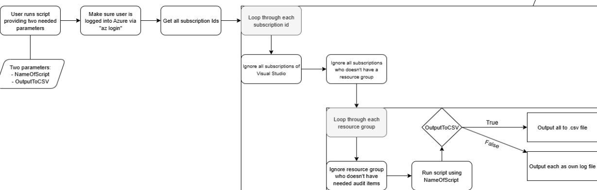

# azure-audit

The Azure Audit project automates many of the audits found in the Center for Internet Security (CIS) Azure Cloud Platform Foundation Benchmark. There is one script per benchmark. The script is named after the corresponding benchmark. The scripts can enumerate all resource groups in an organization and scan each, or the user can pass in the subscription and resource group as a parameter.

## Current use cases from CIS Foundations & Database Benchmarks

1. Cache for Redis: Ensure public network access is disabled (2.6)
2. Cosmos DB: Ensure firewalls & networks not open to all (3.1)
3. Virtual Machines: Ensure only MFA identities can access privileged VMs (4.1.1)
4. Azure PostgreSQL: Ensure allow access to azure services is disabled (7.7)
5. Key Vault: Ensure public network access when using private endpoint is disabled(9.3.7)
6. SQL Database: Ensure no databases allow ingress from 0.0.0.0/0 (10.2)
7. Storage Accounts: Ensure private endpoints are used to access (10.3.2.1)
8. Storage Accounts: Ensure public network access is disabled (10.3.2.2)
9.  Storage Accounts: Ensure default network access rules is set to deny (10.3.2.3)
10. Storage Accounts: Ensure allow blob anonymous access is disabled (10.3.9)

## Usage Instructions (Cloud Shell or Local Terminal)

### Basic Usage
1. After cloning the repo, cd into the src
2. Do az login if you are using VM(this is a first time command only)
3. Pick the audit file you want to run (ex: cis-2.6)
4. Go into the automation file (utility-test-all-subscriptions-on-specific-rule.sh) & uncomment the parse functionality for that specified audit command(ex: cis-2.6 => go to 'uncomment below if want to filter further for cis: 2.6' in the file), then save the file
    - The reason for this is to only grab the azure items with that specified cis audit(no point in the audit if the item doesn't have a cis-2.6 redis database)
5. "Compile": chmod +x *FileNameOfUtilityFile* && chmod +x *FileNameOfAuditFile*
    - Ex: chmod +x utility-test-all-subscriptions-on-specific-rule.sh && chmod +x cis-2.6-ensure-public-network-access-disabled-on-azure-cache-redis.sh
6. Running the script:
    - Output via CSV: ./*FileNameOfUtilityFile* -n ./*FileNameOfAuditFile* -c
        - Ex: ./utility-test-all-subscriptions-on-specific-rule.sh -n ./cis-2.6-ensure-public-network-access-disabled-on-azure-cache-redis.sh -c
    - Output via individual log files: ./*FileNameOfUtilityFile* -n ./*FileNameOfAuditFile*
        - Ex: ./utility-test-all-subscriptions-on-specific-rule.sh -n ./cis-2.6-ensure-public-network-access-disabled-on-azure-cache-redis.sh

### Singular Usage
1. If want to run a singular subscription id on a specified audit case, pick a cis audit case (ex: cis-2.6)
2. "Compile": chmod +x *FileNameOfAuditFile*
3. Running:
    - Output like normal: ./*FileNameOfAuditFile* -s *SUBSCRIPTION_ID* -r *RESOURCE_NAME*
        - Ex: ./cis-2.6-ensure-public-network-access-disabled-on-azure-cache-redis.sh -s *SUBSCRIPTION_ID* -r *RESOURCE_NAME*
    - Output all the JSON objects: ./*FileNameOfAuditFile* -s *SUBSCRIPTION_ID* -r *RESOURCE_NAME* --debug
        - Ex: ./cis-2.6-ensure-public-network-access-disabled-on-azure-cache-redis.sh -s *SUBSCRIPTION_ID* -r *RESOURCE_NAME* --debug

### Multiple Specified Usage
1. If want to run more than one but not all of the subscription ids, go to utility-test-all-subscriptions-on-specific-rule.sh file
2. Find where subscriptions gets populated via 'az account list' and comment it out
3. Uncomment the subscriptions initialization below
4. Replace the 'sub-id-1 sub-id-2 sub-id-3' with your specified subscription ids
5. Run Basic Usage above starting at number 4.

### Other
- Note: The automated test all subscriptions only test enabled subscription ids, to change this, find where subscriptions gets populated via 'az account list'
    - Change 'subscriptions=$(az account list --query "[].id" -o tsv)' to 'subscriptions=$(az account list --query "[].id" -o tsv --all)' to check all

## Dependencies

### An operating system to install the needed software

If you would like to use an Ubuntu virtual machine, you can [install Ubuntu on VirtualBox](https://www.youtube.com/watch?v=Cazzls2sZVk) or other hypervisor. Ubuntu runs better on VirtualBox if [the Guest Additions are installed](https://www.youtube.com/watch?v=8VCeFRwRmRU). If VirtualBox is not installed, you can [install VirtualBox](https://www.youtube.com/watch?v=61GhP8DsQMw).

Base Instructions on how to use Oracle VM with Ubuntu on Windows 11:
1. Download & Install Oracle VirtualBox for WIN
2. Download Ubuntu 24 LTS (6GB)
3. Run Oracle VirtualBox
4. Create new VM with ISO image of Step 2 - up to the user (Naming, RAM, etc…)
5. Install & Configure Ubuntu to your liking in the VM
6. Clone the Azure-Audit GitHub repo

### The Azure Cloud Platform (GPC) *az* client software (not needing Ubuntu not VirtualBox VM)

Base Instructions on how to use the provided shell terminal in Azure
1. Git clone the azure-audit
2. Log in to Azure Portal
3. Click on “Cloud Shell” button in top right
4. Upload the src/includes files
5. Upload the utility-test-all-subscriptions-on-specific-rule file
6. Upload user selected audit file (starting with cis)

### This project

To clone this project, run the following command:

`git clone https://github.com/webpwnized/azure-audit.git`

## Optional Pre-Installation Instructions

1. If you would like to use an Ubuntu virtual machine, [**install Ubuntu on VirtualBox**](https://www.youtube.com/watch?v=Cazzls2sZVk) or other hypervisor. 

2. Ubuntu runs better on VirtualBox if [**the Guest Additions are installed**](https://www.youtube.com/watch?v=AuJGvJoMrgQ). 

3. If VirtualBox is not installed, [**install VirtualBox**](https://www.youtube.com/watch?v=61GhP8DsQMw).

## Flow chart of the automation

